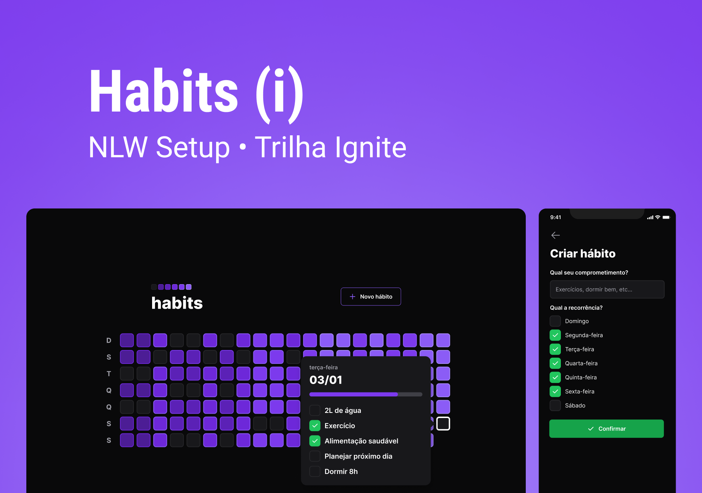

  <h1 align="center">
	  Nlw Setup - web 🚀
  </h1>
  <!-- <h5 align="left">
	  🚀 Ignite Timer is an countdown application.
  </h5>
  <h5 align="left">
	  This application was developed by watching Rocketseat Bootcamp.
  </h5>
  <h5 align="left">
	  As a developer I can never stop learning, I added some new functionallities to take
    the application to the next level, 
    the functionallities are Dark and Light mode of course, 
    I made E2E tests with cypress.
  </h5> -->

# Tabela de conteúdos

<!-- - [About](#about)
- [Final application](#application)
  - [Requirements](#requirements) -->

- [Tecnologies](#technologies)
<!--te-->

## Getting Started

  <h2>This application is being built using the following technologies:</h2>
  
  - [ReactJS](https://pt-br.reactjs.org/)
  - [TypeScript](https://www.typescriptlang.org/)
  - [TailwindCSS](https://styled-components.com/)
  - [Phosphor-icons](https://phosphoricons.com/)
  - [ViteJS](https://phosphoricons.com/)
  <!-- - [Cypress](https://docs.cypress.io/) -->

  <h2>Features</h2>
  
    - [x] Cria um novo hábito
    - [x] Marca um hábito como concluído
    - [x] Marca um hábito como não concluído

<!-- 

  <h2>Aprendizados</h2>

    - light e dark mode com styled-components
    - persistir informaçoes no localStorage
    - utlizar o hook useReducer
    - criar um contexto para compartilhar informações pela aplicação
    - testes E2E com cypress

 -->

<!-- 

  <h2>You can see the final application here: </h2>

  - [Ignite Timer](https://ignite-timer-flv-pa6g-5n9v5jmmq-flvsantos15.vercel.app/)

 -->

  <h2>Autor</h2>

 
  
 <b>Flavio Santos</b>

Built with ❤️ by Flavio Santos 👋🏽 get in touch!

